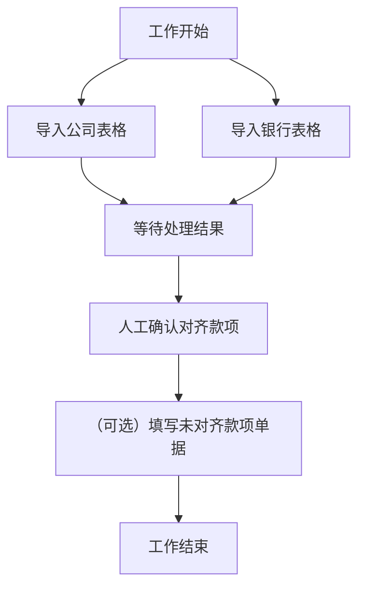

# HuanweiDZ 开发笔记

## 需求

开发一种对账工具，对于银行端以及公司端的账本（Excel 2007 表格文件）进行处理，以试图对账。

对账之后，齐平的项目需要人工确认，不能平的项目，给出单据进行填写。（这一部分想用网页的方式呈现）

## 开发版本: Version 0.0.0.1

项目确立，进行了基础的开发工作。

工作流程

目前遇到的问题，数据如何呈现？

目前设计理念，首先生成一个对象，叫做 workflow，workflow包含了以下属性

1. 两个会计簿对象，一个银行侧，一个公司侧。
2. 一个叫做`BalancedPairCollection` 的集合对象。由一系列的`BalancedPair`组成， 含有两个会计簿对象。两个会计簿的借方贷方总和平衡。
3. 对账进行处理时，会将银行侧和公司侧会计簿中，将可以配平的款项逐个加入。剩下的就是银行和公司中不能配平的款项。

窗体显示整个workflow，

## 知识点：如何正确建立会计款项以及会计簿对象

程序中有两个重要对象。

### 对象：会计款项

会计款项代表了一个会计款项的内容，其中含有的属性为：发生日期，凭证号，摘要，借方，贷方，方向，余额。

### 对象：会计簿

会计簿代表了一个由多个会计款项组成的集合。除了会计款项集合之外，还包含了一些方法。例如合并，移除，对账，等。

## 知识点：如何生成一个集合对象

事实上，日期并不重要。在针对整个表单进行配平的时候，所有之前的信息都可以归结到信息这一个对象上。

真正重要的只有借方、贷方、方向、和余额。

